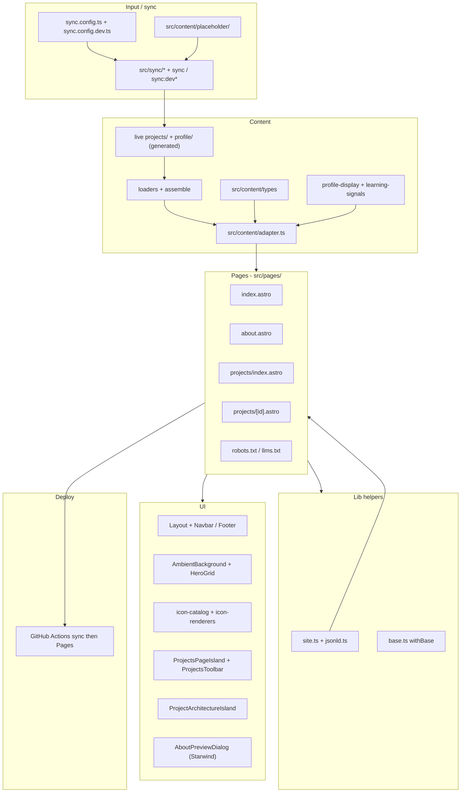

# Architecture — agent briefing

> **TL;DR:** Astro static portfolio on GitHub Pages. Live content in generated `src/content/projects|profile` (Collections + loaders) behind `src/content/adapter.ts`; committed fixtures in `placeholder/`. Sync: `bun run sync` (prod) / `sync:dev*` (local). Starwind/static shell + shadcn React islands. No DB/runtime CMS/auth.

## System identity

| Property      | Value                                                                                                                                                   |
| ------------- | ------------------------------------------------------------------------------------------------------------------------------------------------------- |
| Name          | portfolio (Astro)                                                                                                                                       |
| Purpose       | Portfolio for Arjun Malhotra (DevOps / Web / MLOps)                                                                                                     |
| Pattern       | Content Collections SSG + optional build-time GitHub sync                                                                                               |
| Data boundary | `src/content/**` via loaders → `src/content/adapter.ts` ([ADR 0003](./adr/0003-content-collections-and-sync.md))                                          |
| Network data  | Build-time sync only (GitHub API); runtime content has no fetch; external links are plain `<a href>`                                                    |
| Persistence   | None server-side; `localStorage` keys `theme`, `motion`, `ambient-mode-dark` / `ambient-mode-light`, `projects:view`; projects filters also sync to URL |
| Navigation    | Astro `ClientRouter` view transitions; Navbar/Footer/Ambient `transition:persist`; prefs re-applied on `astro:before-swap` / `after-swap`; project card↔detail shared-element morph (`project-{id}-image` / `-title`) |

## Layer diagram

**Invariant:** Pages load content through the adapter (not `astro:content`, not a deleted `src/data/*` store). Interactive UI lives in React islands.

## File index

| Path                                                   | Role                           | Agent notes                                                                          |
| ------------------------------------------------------ | ------------------------------ | ------------------------------------------------------------------------------------ |
| `src/content/placeholder/profile/` + `projects/<id>/`  | Committed fixture SoT          | Copied into live roots by `sync:dev*`; loaders never scan here                       |
| `src/content/profile/` / `projects/<id>/`              | Live Collections roots         | Generated + gitignored; filled by sync / sync:dev*                                   |
| `src/content/loaders/*` + `assemble/*`                 | Collections assembly           | Loaders own domain-shaped `data` (live roots only)                                   |
| `src/content/types/*`                                  | Domain types                   | `Project`, `Profile`, `STATUS_ORDER`, `sortDate`                                     |
| `src/content/adapter.ts`                               | Content seam                   | Async getters; re-exports display helpers; exclusive page import                     |
| `src/content/profile-display.ts`                       | Profile presentation rules     | Experience headline/timeline, cert empty-hide, learning parse helpers                |
| `src/content/learning-signals.ts`                      | Build-time learning gate       | `LEARNING_SIGNALS_ENABLED` via `astro:env/server`                                    |
| `src/content.config.ts`                                | Collection definitions         | `projects` + `profile` loaders                                                       |
| `sync.config.ts` / `sync.config.dev.ts` + `src/sync/*` | Input layer                    | Prod GitHub sync; dev fixture materialize (± remotes)                                |
| `src/layouts/Layout.astro`                             | HTML shell + meta / JSON-LD    | `ClientRouter`; AmbientBackground; theme/motion/page-transition FOUC; canonical + OG |
| `src/lib/page-transition.ts`                           | VT helpers                     | Parallel main-content fade + shared-element name helpers; skip when `data-motion=reduced` |
| `src/lib/site-prefs-client.ts`                         | Client prefs + VT lifecycle    | Theme/motion/ambient bind, nav sync, swap restore                                    |
| `src/pages/index.astro`                                | Home                           | SOURCE hero + `HeroGrid`; featured via adapter                                       |
| `src/pages/about.astro`                                | About                          | Adapter + profile-display; Starwind preview dialogs                                  |
| `src/pages/projects/index.astro`                       | Project list                   | `ProjectsPageIsland`                                                                 |
| `src/pages/projects/[id].astro`                        | Project detail                 | Build-time markdown + architecture island                                            |
| `src/pages/robots.txt.ts`                              | robots.txt                     | Sitemap URL via `absoluteUrl`                                                        |
| `src/pages/llms.txt.ts`                                | llms.txt                       | Adapter + absolute URLs for assistants                                               |
| `src/pages/404.astro`                                  | Not found                      | Starwind `Button`                                                                    |
| `src/components/HeroGrid.tsx`                          | Hero grid ripples              | Home island; respects `data-motion`                                                  |
| `src/components/AmbientBackground.tsx`                 | Ambient canvas/blobs           | Site-wide island                                                                     |
| `src/components/AmbientToggle.astro`                   | Ambient cycle control          | Astro markup; bound in `site-prefs-client` (VT-safe)                                 |
| `src/components/MotionToggle.astro`                    | Motion preference control      | Astro markup; bound in `site-prefs-client` (VT-safe)                                 |
| `src/components/ProjectsToolbar.tsx`                   | Search token / filter UI       | Deep UI; pairs with island for apply + URL                                           |
| `src/components/islands/ProjectsPageIsland.tsx`        | Projects list island           | Filter apply, sort, URL sync, cards/rows                                             |
| `src/components/islands/ProjectArchitectureIsland.tsx` | Architecture island            | Shared `selectedId`; fallback when no graph                                          |
| `src/components/AboutPreviewDialog.astro`              | Cert/resume previews           | Starwind dialog (no React island)                                                    |
| `src/lib/icon-catalog.tsx`                             | Icon maps only                 | `UI_ICONS` + `BRAND_ICONS` + brand coverage helpers; no `lucide-react`               |
| `src/lib/icon-renderers.tsx`                           | Icon paint                     | `UiIcon` (Lucide chrome) + `BrandIcon` (letter fallback, `.brand-icon`)              |
| `src/lib/site.ts`                                      | Absolute / canonical URLs      | Uses `withBase` + `Astro.site`                                                       |
| `src/lib/jsonld.ts`                                    | Person / project JSON-LD       | Fed into Layout `jsonLd` prop                                                        |
| `src/components/ui/*`                                  | shadcn Base UI                 | Icons via `~icons/lucide/*` (rewrite after shadcn regen; never `lucide-react`)       |
| `src/lib/markdown.ts`                                  | Build-time MD → HTML           | `marked` + GFM                                                                       |
| `src/lib/base.ts`                                      | `withBase()`                   | Prefix with `import.meta.env.BASE_URL`                                               |
| `src/styles.css`                                       | Design tokens + Tailwind       | ambient / frosted / motion; VT presets; Astro Fonts tokens                           |
| `astro.config.mjs`                                     | Astro config                   | `output: "static"`, Fonts API, telemetry off                                         |
| `.github/workflows/ci.yml`                             | PR/push verify                 | `sync:dev` → lint → check → test → build; no PAT; `ASTRO_TELEMETRY_DISABLED`         |
| `.github/workflows/deploy.yml`                         | GH Pages deploy (`main`)       | `bun run sync` then build; `PORTFOLIO_GITHUB_TOKEN` → `GITHUB_TOKEN`                 |

## Routes

| URL              | File                             | Data access                |
| ---------------- | -------------------------------- | -------------------------- |
| `/`              | `src/pages/index.astro`          | Adapter                    |
| `/about`         | `src/pages/about.astro`          | Adapter + profile-display  |
| `/projects`      | `src/pages/projects/index.astro` | Island + adapter projects  |
| `/projects/[id]` | `src/pages/projects/[id].astro`  | `getStaticPaths` + adapter |
| `/robots.txt`    | `src/pages/robots.txt.ts`        | `site.ts`                  |
| `/llms.txt`      | `src/pages/llms.txt.ts`          | Adapter + `site.ts`        |
| 404              | `src/pages/404.astro`            | —                          |

## UI hybrid (ADR 0002)

- **Starwind / Astro markup** for static shell (navbar, footer, 404 button, most page chrome)
- **shadcn React islands** for ProjectsToolbar, architecture diagram + accordion, ambient/motion/HeroGrid
- **About dialogs:** Starwind static dialogs (not Radix islands)
- **Icons:** `icon-catalog` + `icon-renderers` (`UiIcon` / `BrandIcon`); islands prefer `UiIcon`; `ui/`* uses `~icons/lucide/*` directly — no `lucide-react`
- **Theme:** custom toggle — not Starwind `theme-toggle`
- **Prose:** `@tailwindcss/typography` + build-time `marked` — not Starwind Prose

## Deploy / CI

| Workflow | When | What |
| --- | --- | --- |
| [`ci.yml`](../../.github/workflows/ci.yml) | `pull_request` + push to `main` / `lovable-astro-migration` | `bun run sync:dev` → lint → check → test → build (fixtures; no PAT) |
| [`deploy.yml`](../../.github/workflows/deploy.yml) | push to `main` (+ `workflow_dispatch`) | `bun run sync` → `build` → GitHub Pages (prod remotes only) |

**Secrets / vars**

| Name | Where | Purpose |
| --- | --- | --- |
| `PORTFOLIO_GITHUB_TOKEN` | Actions **secret** | PAT (Contents+Metadata) for private remotes; deploy maps → env `GITHUB_TOKEN` for sync |
| `ASTRO_SITE` | Actions **variable** | Canonical site URL (fallback placeholder in workflows) |
| `ASTRO_BASE` | Actions **variable** | Pages project base, e.g. `/repo-name` (local `.env`: `/`) |

- Local: `ASTRO_BASE=/` in `.env`; `bun run sync:dev` for fixtures; prod/`sync:dev:all` remotes need `GITHUB_TOKEN` (see `.env.example`)
- Both workflows set `ASTRO_TELEMETRY_DISABLED=1`
- All internal hrefs/assets: `withBase()`

## See also

- `[adr/0001-content-as-code.md](./adr/0001-content-as-code.md)` (superseded)
- `[adr/0002-astro-starwind-shadcn-hybrid.md](./adr/0002-astro-starwind-shadcn-hybrid.md)`
- `[adr/0003-content-collections-and-sync.md](./adr/0003-content-collections-and-sync.md)`
- `[module-seams.md](./module-seams.md)` — where complexity lives (post-port Astro seams)
- `[route-trace.md](./route-trace.md)`
- Human design docs under [`docs/`](../../docs/README.md)
