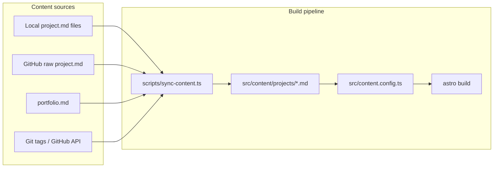

# Astro Portfolio Website — Implementation Plan

## Current state

The repo is an early Astro 6 scaffold with React integration and partial Starwind setup ([`starwind.config.json`](starwind.config.json), [`src/styles/starwind.css`](src/styles/starwind.css)), but almost no app code:

- Empty: [`src/layouts/Layout.astro`](src/layouts/Layout.astro), [`src/content.config.ts`](src/content.config.ts), [`src/pages/all-projects.astro`](src/pages/all-projects.astro), [`src/pages/about-me.astro`](src/pages/about-me.astro), [`src/pages/projects/[project].astro`](src/pages/projects/[project].astro)
- [`src/pages/index.astro`](src/pages/index.astro) is still the Astro starter stub
- Missing packages from README: `astro-icon`, Starwind components, React Flow, Beasties
- Working reference implementation lives in [`docs/main-reference/`](docs/main-reference/) (React + Vite app — **design source only**, not copied as-is)
- GH Pages workflow exists at [`.github/workflows/01-gh-pages-deploy.yaml`](.github/workflows/01-gh-pages-deploy.yaml)



---

## Your decisions (locked in)

| Decision | Choice |
|---|---|
| Project IDs | `PROJ-BE-001` style — **no status suffix** |
| Version / status / release date | Derived from **semver git tags** at build time |
| Content pipeline | **Hybrid B+C**: sync script pulls local + remote MD, writes into **Content Collections** as the typed source of truth |

### Semver → status mapping (build-time)

Per [`docs/features/method for storing version, status & date of latest release`](docs/features/method%20for%20storing%20version,%20status%20&%20date%20of%20latest%20release) and [`docs/Project-Flow.md`](docs/Project-Flow.md):

- `v1.2.0` → status `prod`, version `1.2.0`
- `v1.2.0-beta.1` → status `beta`
- `v1.2.0-alpha.1` → status `alpha`
- `v1.3.0-dev+…` → status `dev` (global dev builds, not re-using alpha/beta after prod)
- Release date: annotated tag **tagger date** (not commit author date); fallback to GitHub Releases API tag date
- After a project reaches prod on `main`, it never shows alpha/beta again (one-way lifecycle)

---

## Explicitly out of scope (first pass)

Per [`docs/design & guidelines.md`](docs/design%20&%20guidelines.md):

- **Advanced search / filter / sort** on Projects page (property-based search, combobox, list view toggle) — defer to a later milestone
- **Remote live refresh** via localStorage
- **WASM demo embedding** for non-web projects
- Full **Motion / AstroAnimate** stack — start with README **Animation Version A** only (CSS + Astro View Transitions)

Architecture diagram: ship a **placeholder** in Phase 2–3, full **React Flow** island in Phase 5.

---

## Phase 1 — Content & Data (commit 1)

**Goal:** Type-safe data layer; site renders plain structured HTML.

### 1a. Content Collections schema

Define in [`src/content.config.ts`](src/content.config.ts):

**`projects` collection** (Zod schema aligned with [`docs/all-internal-data.md`](docs/all-internal-data.md)):

```ts
// Essential fields
id: string           // PROJ-BE-001
slug: string
name: string
category: enum         // backend | devops | mlops
type: string           // e.g. "CI/CD Pipeline"
summary: string
description: string    // markdown body
techStack: string[]
relatedProjects: string[]  // other project IDs
previewImage?: string
repoUrl?: string
liveUrl?: string
featured: boolean
// Injected by sync (not in source MD)
version: string
status: enum           // alpha | beta | prod | dev | archived
releaseDate: string    // ISO date
```

**`personal` collection** — single entry from `portfolio.md` (hero, about, skills, experience, certifications, socials, resume path).

### 1b. Rewrite sync script

Port [`docs/main-reference/scripts/sync-projects.ts`](docs/main-reference/scripts/sync-projects.ts) → `scripts/sync-content.ts`:

- Read [`projects-config.json`](projects-config.json) (local dir + remote repos list, same shape as main-reference)
- Parse project markdown using [`docs/Project_Template.md`](docs/Project_Template.md) section headings
- **Strip status suffix** when migrating old IDs (`PROJ-BE-001-PROD` → `PROJ-BE-001`)
- Derive `category` from ID segment (`BE` → backend, `DO` → devops, `ML` → mlops)
- For each project's `repoUrl`, fetch latest tag on `main` via GitHub REST API (`GET /repos/{owner}/{repo}/tags`, sort semver); use `GITHUB_TOKEN` in CI for rate limits / private repos
- Write one file per project to `src/content/projects/{slug}.md` with YAML frontmatter + markdown body
- Parse `portfolio.md` → `src/content/personal/site.md`
- Add `"prebuild": "tsx scripts/sync-content.ts"` to [`package.json`](package.json)

### 1c. Seed content

Copy and normalize the 4 sample projects from [`docs/main-reference/src/content/projects/`](docs/main-reference/src/content/projects/) (update IDs to drop status suffix). Add placeholder `portfolio.md` and `projects-config.json`.

### 1d. Minimal render pages

Wire [`src/pages/index.astro`](src/pages/index.astro), [`src/pages/projects/[slug].astro`](src/pages/projects/[slug].astro) to `getCollection('projects')` — unstyled lists/titles only to validate the pipeline.

---

## Phase 2 — Layout & Structure (commit 2)

**Goal:** Fully navigable responsive wireframe matching main-reference aesthetics.

### Design tokens (merge two sources)

| Source | What to port |
|---|---|
| [`docs/main-reference/src/app/styles/index.css`](docs/main-reference/src/app/styles/index.css) | Dark editorial palette (`--theme-bg`, `--nav-bg`, mesh blobs for light mode), Playfair + Inter fonts, `no-scrollbar` utility |
| [`src/styles/starwind.css`](src/styles/starwind.css) | Zinc shadcn-style CSS variables for Starwind components |

Create [`src/styles/global.css`](src/styles/global.css) importing both; set category accent colors (BE blue, DO purple, ML orange per your todo).

### Starwind components to add

Run `pnpx starwind@latest add` for:

- `button`, `card`, `badge`, `separator`, `tabs`, `carousel` (homepage horizontal scroller), `aspect-ratio`, `prose` (project description), `accordion` (architecture steps placeholder), `theme-switcher` ([pro variant 02](https://pro.starwind.dev/components/theme-switcher/theme-switcher-02/) from your todo)

### Layout & pages

| Route | File | Sections (from design guidelines) |
|---|---|---|
| `/` | `src/pages/index.astro` | Hero (name, tagline, services list), featured/recent projects carousel (limit 3) |
| `/projects` | `src/pages/projects/index.astro` | Header, **category tabs only** (All / DevOps / Backend / ML) — no search yet |
| `/projects/[slug]` | `src/pages/projects/[slug].astro` | Hero (preview, id, title, summary, links), 2/3 + 1/3 description + properties sidebar, related projects, architecture placeholder |
| `/about` | `src/pages/about.astro` | Bio + photo, skills grid, experience, certifications, resume embed, contact CTA |

### Shared components (native `.astro`)

Port structure from main-reference React components:

- `src/components/layout/Navbar.astro` — initials, nav links, theme toggle, AI Assisted badge
- `src/components/layout/Footer.astro`
- `src/components/project/ProjectCard.astro` — preview area, category badge, title, summary, tech icons (3 + N)
- `src/components/project/ProjectGrid.astro`
- `src/components/home/HorizontalScroller.astro` — uses Starwind Carousel
- `src/layouts/Layout.astro` — `<html>`, meta, fonts, navbar, footer, `<slot />`

### Fonts

Use Astro 6 **Fonts API** in [`astro.config.mjs`](astro.config.mjs) for Inter + Playfair Display (self-hosted at build, no Google CDN calls).

### Routing cleanup

Rename stubs: `all-projects.astro` → `projects/index.astro`, `about-me.astro` → `about.astro`, `[project].astro` → `[slug].astro`.

---

## Phase 3 — Interaction Logic (commit 3)

**Goal:** Functional UI without animation polish.

- **Theme switcher**: `localStorage` + `class="dark"` / `class="light"` on `<html>`, respect `prefers-color-scheme` default; mesh background opacity toggle
- **Projects category tabs**: client-side filter via a small React island OR vanilla `<script>` + `data-category` attributes (prefer vanilla to minimize React overhead)
- **Mobile nav**: hamburger toggle (Starwind or minimal custom)
- **Resume modal**: Starwind Dialog on About page
- **Icon resolver**: port [`docs/main-reference/src/lib/utils.ts`](docs/main-reference/src/lib/utils.ts) `getTechIcon` mapping; wire through **astro-icon** with `@iconify-json/simple-icons` + `@iconify-json/devicon` packs; colored icons in light mode, CSS grayscale filter in dark mode (per design guidelines)

Install: `astro-icon`, `@iconify-json/simple-icons`, `@iconify-json/ph` (Phosphor for UI icons).

---

## Phase 4 — Asset Optimization (commit 4)

**Goal:** Lighthouse-ready before motion.

- Add `previewImage` assets under `src/assets/projects/`; use Astro `<Image />` in cards and project hero
- Self-host favicon (already in `public/`)
- Add `resume.pdf` placeholder in `public/`
- Configure `astro:env` schema in `astro.config.mjs` for `PUBLIC_SITE_URL`, `PUBLIC_BASE_PATH` (already used in workflow + [`example.env`](example.env))
- Run Lighthouse locally; fix largest issues (font preload, image dimensions, unused CSS)

---

## Phase 5 — Animation (commit 5)

**Goal:** Version A animations only (per README).

- Enable `<ViewTransitions />` in Layout
- CSS transitions: card hover line, navbar blur, theme switch, tab underline
- Entry: subtle `opacity` + `translateY` via CSS `@starting-style` or lightweight CSS animations (no Motion yet)
- **Architecture diagram React island** (`src/components/project/ArchitectureDiagram.tsx`):
  - `@xyflow/react` with `client:visible`
  - Reads node/step data from project frontmatter or co-located `architecture.json`
  - Bidirectional highlight with Starwind Accordion steps list
  - Start with static sample data for one project; document expected `architecture.tsx` format in project repos for future sync

Defer AstroAnimate and Framer Motion unless a specific interaction cannot be done in CSS.

---

## Phase 6 — Deployment (commit 6)

**Goal:** Live on GitHub Pages.

- Add **Beasties** post-build step for critical CSS inlining (integrate via Vite plugin or post-build script in `package.json`)
- Finalize [`astro.config.mjs`](astro.config.mjs): `site`, `base`, React, icon, fonts integrations
- Update CI workflow: run sync script with `GITHUB_TOKEN`, then `pnpm build`
- Verify `PUBLIC_BASE_PATH=/${{ github.event.repository.name }}` produces correct asset paths
- Document deploy trigger (`deploy` in commit message or `workflow_dispatch`)

---

## File structure (target)

```text
src/
├── assets/projects/          # preview images
├── components/
│   ├── layout/               # Navbar, Footer
│   ├── project/              # ProjectCard, ProjectGrid, ArchitectureDiagram.tsx
│   └── home/                 # HorizontalScroller
├── content/
│   ├── projects/             # generated by sync script
│   └── personal/             # generated from portfolio.md
├── content.config.ts
├── layouts/Layout.astro
├── lib/utils.ts              # cn, getTechIcon
├── pages/
│   ├── index.astro
│   ├── about.astro
│   └── projects/
│       ├── index.astro
│       └── [slug].astro
└── styles/
    ├── global.css
    └── starwind.css
scripts/
└── sync-content.ts
projects-config.json
portfolio.md
```

---

## Risks & mitigations

| Risk | Mitigation |
|---|---|
| GitHub API rate limits during sync | `GITHUB_TOKEN` in CI; cache tag responses; optional local override in frontmatter for dev |
| Remote `project.md` format drift | Strict parser with validation errors in sync; document template in [`docs/Project_Template.md`](docs/Project_Template.md) |
| Starwind + custom editorial CSS conflict | Starwind for interactive primitives; custom CSS for page-level typography/spacing only |
| React Flow bundle size | `client:visible` hydration; lazy-load only on project pages with architecture data |

---

## Future milestones (post-plan)

- Property-based search/filter/sort ([`docs/features/search, filters & sorting/`](docs/features/search,%20filters%20&%20sorting/))
- Homepage experience timeline section
- Animation Version B (AstroAnimate) / C (Motion island)
- Sync `architecture.tsx` from project repos
- Real personal data + project images
