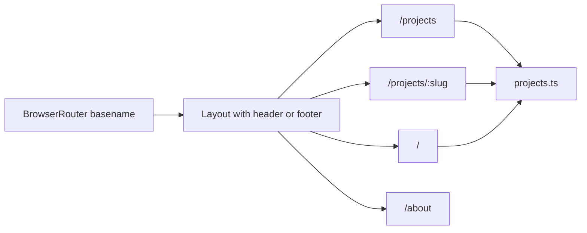

# Portfolio site for GitHub Pages

## Static-only constraints (GitHub Pages)

GitHub Pages serves **static files only**: there is **no** application server, **no** backend runtime, and **no** database on their side.

- **Build output**: `bun run build` produces pure static assets (`dist/`: `index.html`, JS/CSS bundles, hashed assets). That is what you deploy.
- **Data**: All portfolio content (project list, summaries, URLs) is **authored in the repo** — for example `src/data/projects.ts` bundled into the JS at build time. Updates mean edit files, rebuild, redeploy.
- **Media**: Images and `resume.pdf` live under `public/` and are copied into `dist/` as plain files.
- **Routing**: `react-router-dom` runs **in the browser** only; the server still only returns static files. Copying `index.html` to `404.html` after build makes deep links work without server rewrites (standard GitHub Pages SPA pattern).
- **Backend / DevOps categories**: These are **categories of work you showcase** (topics for portfolio projects), not services you host on GitHub Pages.

Anything dynamic at runtime (comments, CMS, auth) would require an external service; this plan stays **fully static**.

## Current state

- Minimal app: `src/App.tsx` is a placeholder only; no router.
- Stack matches AGENTS.md: Bun, Vite, React 19, TypeScript, Tailwind 4, shadcn (`base-lyra`), Phosphor icons, `src/components/ui/button.tsx`.
- `vite.config.ts` has **no `base`**, which is required for GitHub **project** pages (`https://user.github.io/repo-name/`).

## Architecture

- **Single source of truth**: `src/data/projects.ts` exports an array of projects plus helpers (`getProjectBySlug`, filter by category).
- **Types**: `src/types/project.ts` — `interface Project` with `slug`, `name`, `category: "backend" | "devops"`, `summary`, `details` (string or string[]), `architecture` (string or structured blocks), `technologies: string[]`, optional `previewImage` (path under `public/`), optional `websiteUrl`, `repositoryUrl`. Prefer `interface` everywhere per AGENTS.

## Routing and dependencies

- Add **react-router-dom**; wrap the app in **BrowserRouter** with `**basename={import.meta.env.BASE_URL}`** (Vite provides this from `base`).
- Routes: `/`, `/projects`, `/projects/:slug`, `/about`. Use `**<Navigate replace />`** for unknown slugs on the detail page.
- **vite.config.ts**: set `base` for production. Example: `base: process.env.VITE_BASE_URL ?? "/"` so you can set `VITE_BASE_URL=/repo-name/` when building for GitHub Pages.
- **SPA fallback**: After `vite build`, copy `dist/index.html` to `dist/404.html`. Add a small cross-platform step in the `build` script (e.g. Bun one-liner).

## Pages and UI

| Route             | Content                                                                                                                                              |
| ----------------- | ---------------------------------------------------------------------------------------------------------------------------------------------------- |
| `/`               | **Hero** (name, role, CTAs to projects/about); **Projects** — Backend and DevOps sections with a short list of cards each plus link to full catalog. |
| `/projects`       | List/filter by category; **project cards** (shadcn Card, Badge) with **View details** linking to `/projects/:slug`.                                  |
| `/projects/:slug` | Name, summary, optional preview image, architecture, details, technology chips, **Website** and **Repository** links (Button + Phosphor) when set.   |
| `/about`          | Summary, skills, **resume PDF** embedded with `<iframe title="Resume" src={...} />` using `import.meta.env.BASE_URL` + `resume.pdf` in `public/`.    |

Add shadcn components as needed (card, badge, separator). Reuse existing Button.

## Layout and shared components

- `src/components/layout/site-header.tsx`: title + nav; responsive.
- Optional `site-footer.tsx`.
- `src/components/project/project-card.tsx`: reused on home and all-projects.
- Pages under `src/pages/`: `home-page.tsx`, `all-projects-page.tsx`, `project-detail-page.tsx`, `about-page.tsx` (kebab-case files; PascalCase component exports).

## Design direction (SKILL.md)

One clear aesthetic (example: **industrial / terminal-adjacent** for backend + DevOps):

- **Typography**: Keep JetBrains Mono for UI/code accents; add a **display** font via `@fontsource` and `--font-display` in `src/index.css` `@theme`.
- **Color**: Adjust CSS variables in `:root` / `.dark` (e.g. charcoal + amber or slate + teal). Keep shadcn token names.
- **Background**: Subtle noise, mesh, or pattern via CSS.
- **Motion**: Staggered reveals (`animation-delay`); restrained card hovers. Use `tw-animate-css` where it helps.

Avoid generic AI-default look (Inter, purple gradients on white, cookie-cutter layouts).

## Content

- Seed **4–6 placeholder projects** (mix backend and devops) for easy replacement later.
- `index.html`: update `<title>` and meta description.

## Verification

- `bun run dev` — routes work with `base: "/"`.
- `VITE_BASE_URL=/test/ bun run build` then `bun run preview` — assets and basename behave.
- `bun run lint` and `bun run typecheck` pass.

## Files to add or touch

| Area   | Files                                                                                                                                                                      |
| ------ | -------------------------------------------------------------------------------------------------------------------------------------------------------------------------- |
| Config | `package.json` (deps + post-build 404 copy), `vite.config.ts` (`base`)                                                                                                     |
| Entry  | `main.tsx` or `App.tsx` — router shell                                                                                                                                     |
| New    | `src/types/project.ts`, `src/data/projects.ts`, `src/pages/*.tsx`, `src/components/layout/*.tsx`, `src/components/project/project-card.tsx`, optional `src/app/routes.tsx` |
| Styles | `src/index.css` — fonts, theme, layout helpers                                                                                                                             |
| Public | `public/resume.pdf` (user can replace)                                                                                                                                     |

No API keys; external URLs are normal anchor links only.