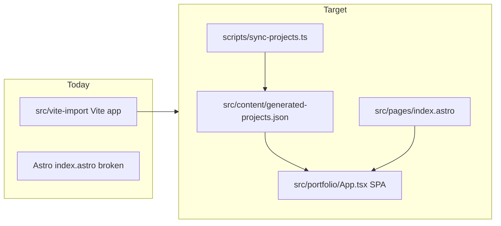

# Portfolio + Astro integration plan

## Current state

| Location | What it is |
|----------|------------|
| [Astro/package.json](package.json) | Astro 6 + React + Tailwind 4 + `astro-icon` (integration already in [astro.config.mjs](astro.config.mjs)) |
| [Astro/src/pages/index.astro](src/pages/index.astro) | Broken stub: imports missing `./Home.tsx`, uses minimal [global.css](src/styles/global.css) only |
| [Astro/src/vite-import/](src/vite-import) | **Canonical** full Vite portfolio (nested `package.json`, `src/`, [scripts/sync-projects.ts](src/vite-import/scripts/sync-projects.ts)) |
| [docs/PORTFOLIO_SETUP_GUIDE.md](docs/PORTFOLIO_SETUP_GUIDE.md) | Describes sync + `VITE_BASE_URL`; paths need aligning with Astro |

Original portfolio uses **`@iconify/react`** (`icon="ph:..."` prop) in [Home.tsx](src/vite-import/src/pages/Home.tsx), [Navbar.tsx](src/vite-import/src/components/layout/Navbar.tsx), [ProjectCard.tsx](src/vite-import/src/components/project/ProjectCard.tsx), etc. Astro already has **`astro-icon`** — no need for a second icon runtime.



## Recommended routing (you were unsure)

**Keep React Router as a single Astro page** (`<App client:only="react" />`) so layout, Motion, theme toggle, and nav behave exactly like the Vite app. This matches your “don’t touch UI unless you ask” preference.

- Astro file-based routes (`/projects/[slug].astro`, etc.) are better long-term for SEO but require replacing `react-router-dom` `Link`/`useParams` across the app — defer unless you want that later.

**GitHub Pages + client router:** after `astro build`, copy `dist/index.html` → `dist/404.html` (same trick as [vite-import package.json `build` script](src/vite-import/package.json)) so deep links like `/portfolio/projects/foo` work.

**Base URL:** `base: '/portfolio/'` in [astro.config.mjs](astro.config.mjs) (repo slug `portfolio`). React Router already uses `import.meta.env.BASE_URL` in [App.tsx](src/vite-import/src/App.tsx).

## Icons: astro-icon only (not @iconify/react)

`astro-icon` v1 uses Iconify sets via installed `@iconify-json/*` packages and the same `pack:icon` names you already use (`ph:gear-light`, `simple-icons:go`, etc.).

**Approach (smallest diff):** add a thin React wrapper so call sites stay familiar:

```tsx
// src/components/Icon.tsx
import { Icon as AstroIcon } from "astro-icon/components";

export function Icon({ icon, ...props }: { icon: string } & React.ComponentProps<typeof AstroIcon>) {
  return <AstroIcon name={icon} {...props} />;
}
```

Then replace `import { Icon } from "@iconify/react"` → `@/components/Icon` (or relative) in portfolio files only; **no visual redesign**.

**Dependencies to add** (dev) on Astro root:

- `@iconify-json/ph` — Phosphor icons used everywhere
- `@iconify-json/simple-icons` — tech stack via [getTechIcon](src/vite-import/src/lib/utils.ts)
- `@iconify-json/devicon` — `devicon-plain:*` entries (seaborn, matplotlib, kubeflow)

**Optional** in `astro.config.mjs` `icon({ include: { ph: [...], "simple-icons": [...] } })` to trim bundle size once icon list is known; start permissive, tighten later.

**Do not add** `@iconify/react` to the Astro app.

**Small consistency fix (not a redesign):** [ProjectCard.tsx](src/vite-import/src/components/project/ProjectCard.tsx) has a hard-coded inline SVG for the arrow; swap to `<Icon icon="ph:arrow-up-right" />` like the rest of the file.

## Source layout after migration

Move portfolio code out of the nested Vite tree into Astro `src/` (names can be adjusted, but keep separation from Astro pages):

```
Astro/
  scripts/sync-projects.ts          # moved from vite-import/scripts
  projects-config.json              # moved from vite-import/src/
  src/
    content/projects/*.md
    content/generated-projects.json
    data/data.ts
    types/
    lib/utils.ts
    components/portfolio/...        # layout, project, providers
    portfolio/App.tsx               # former vite-import/src/App.tsx
    app/styles/portfolio.css        # former app/styles/index.css
    pages/index.astro               # shell only
    layouts/PortfolioLayout.astro   # optional: fonts, meta, global CSS import
  public/
    resume.pdf, darkModeBg.svg, favicon, project images...
```

Update imports from `@/src/...` (Vite alias) to `@/...` per [tsconfig.json](tsconfig.json) (`@/*` → `./src/*`).

Remove the nested [src/vite-import/package.json](src/vite-import/package.json), `vite.config.ts`, `index.html`, and lockfiles after migration so there is one install root.

## Sync script fixes (required for correct data)

[scripts/sync-projects.ts](src/vite-import/scripts/sync-projects.ts) has path bugs relative to the nested app:

| Issue | Current | Fix |
|-------|---------|-----|
| Config lookup | `src/projects-config.json` from vite-import cwd | `projects-config.json` at **Astro repo root** |
| Local markdown dir | `./src/content/project` in [projects-config.json](src/vite-import/src/projects-config.json) | `./src/content/projects` (matches actual folder) |
| JSON output | Writes `src/data/content/generated-projects.json` | Write **`src/content/generated-projects.json`** to match [data.ts](src/vite-import/src/data/data.ts) import |
| Project `id` | H1 `[PROJ-BE-001-PROD]` parsing commented out | Re-enable regex so category/status/slug logic works |

Wire Astro [package.json](package.json):

```json
"sync": "bun run scripts/sync-projects.ts",
"prebuild": "bun run sync"
```

Run sync once after path fixes so local `.md` files populate JSON (today [generated-projects.json](src/vite-import/src/content/generated-projects.json) may only reflect the remote repo).

## Astro shell page

Replace [index.astro](src/pages/index.astro) with a minimal shell:

- Import portfolio CSS ([index.css](src/vite-import/src/app/styles/index.css) → merged or imported as `portfolio.css`)
- Google fonts if used in CSS (`Inter`, `Playfair Display`, `JetBrains Mono`)
- `<App client:only="react" />` (router + theme need the client; `client:load` also works)
- Drop unused template [Button.astro](src/components/Button.astro) / [markdown-page.md](src/pages/markdown-page.md) unless you want them

**Asset path fix (technical, same visual intent):** CSS uses `url('/public/darkModeBg.svg')` but Astro serves `public/` at site root — should be `url('/darkModeBg.svg')` with file in [public/](public/). Confirm you have `darkModeBg.svg` (not in repo today); add or remove the rule only after you confirm.

## Astro config summary

```js
export default defineConfig({
  base: '/portfolio/',
  integrations: [
    react(),
    icon({ /* optional include whitelist */ }),
  ],
  vite: { plugins: [tailwindcss()] },
});
```

Env for local subpath testing: `.env` with `BASE_URL=/portfolio/` (Astro 4+ uses `BASE_URL`; align with how resume/links use `import.meta.env.BASE_URL` in [About.tsx](src/vite-import/src/pages/About.tsx)).

## Dependencies merge (Astro root)

**Add from portfolio (if not already):** `motion`, `clsx`, `tailwind-merge`, `react-router-dom` (already present).

**Do not merge** unused vite-import deps unless needed: `@google/genai`, `express`, `lucide-react`, `@vitejs/plugin-react`.

**Remove from portfolio usage:** `@iconify/react`.

## GitHub Pages deploy (follow-up, optional in same PR)

Add `.github/workflows/deploy.yml`:

- `bun install` / `bun run build` at Astro root
- `BASE_URL=/portfolio/` (or rely on `astro.config` `base`)
- Post-step: copy `dist/index.html` → `dist/404.html`
- Deploy `dist/` with `peaceiris/actions-gh-pages` or `actions/upload-pages-artifact`

Update [PORTFOLIO_SETUP_GUIDE.md](docs/PORTFOLIO_SETUP_GUIDE.md) paths (`src/data.ts` → `src/data/data.ts`, `VITE_BASE_URL` → Astro `base` / `BASE_URL`).

## What we will not change without asking you

- Layout, typography, colors, Motion timings, “AI ASSISTED” badge, theme toggle
- `SITE_DATA` / copy in [data.ts](src/vite-import/src/data/data.ts)
- Project card layout structure (except fixing the arrow to use the same Icon component)

## Optional phase 2 (later)

- Migrate to Astro static routes + `getStaticPaths` for project slugs (better SEO, drop react-router)
- Tighten `icon({ include })` for smaller bundles
- Fix placeholder icons in [utils.ts](src/vite-import/src/lib/utils.ts) (`simple-icons:bun` for many DevOps tools) — **ask before changing mappings**

## Verification checklist

1. `bun run sync` → `generated-projects.json` includes local + remote projects
2. `bun run dev` → home, `/projects`, `/projects/:slug`, `/about` work under `http://localhost:4321/portfolio/`
3. Theme toggle persists; icons render (no missing icon console errors)
4. `bun run build` + `bun run preview` with base `/portfolio/`
5. Resume link resolves to `/portfolio/resume.pdf` when file exists in `public/`
