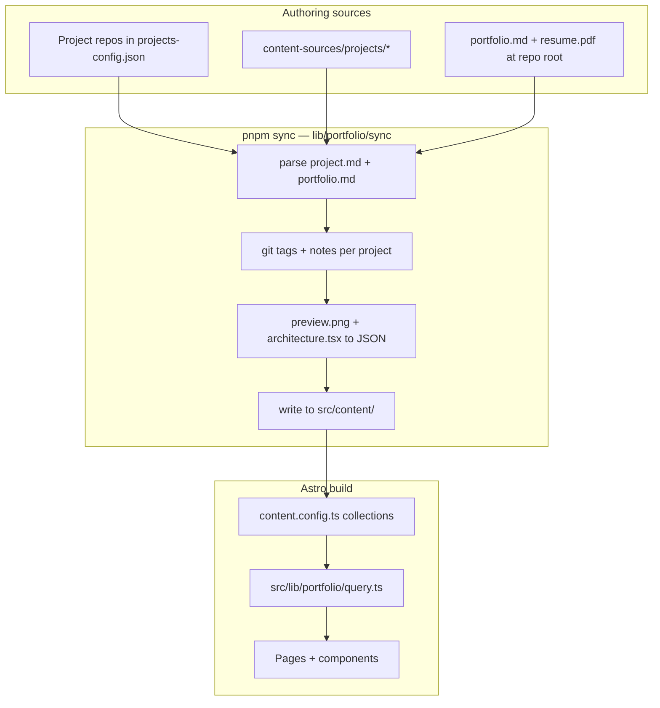

# Architecture flow — intended model vs current code

How content moves from authoring sources through sync into Astro, and where the implementation diverges from a naive mental model. Complements [content-inputs.md](./content-inputs.md) (field definitions) and [ADR-0001](../adr/0001-portfolio-content-module.md) (module layout).

## Short answer

**Mostly yes** on the big picture:

1. Sync runs before build and writes into `src/content/`
2. Project repos (via config) supply per-project files; git metadata is merged per project
3. Personal/portfolio content is synced separately
4. Astro content collections + schema feed the app
5. Icons, fonts, env, etc. are Astro concerns outside sync

**Not exactly** on folder names, file shapes, config scope, and one transform step — detailed below.

---

## Step-by-step comparison

### 1. Sync script runs

**Intended:** Sync runs first.

**Current:** Yes. `scripts/sync-content.ts` calls `syncPortfolio()`; `package.json` runs sync in `prebuild` and before `pnpm dev`.

---

### 1.1 Project files → `./src/content/projects/project-slug/*`

**Intended:** `project.md`, `preview.png`, and `architecture.tsx` land in per-slug directories.

**Current:** Mostly yes, with one important transform:

| File | Naive expectation | Actual output |
|------|-------------------|---------------|
| `project.md` | Copied as-is | **Regenerated** — sync parses source markdown, merges git fields into YAML frontmatter, writes new `project.md` (`lib/portfolio/sync/index.ts` → `writeProjectFile`) |
| `preview.png` | Copied | Copied to `{slug}/preview.png` |
| `architecture.tsx` | Copied as `.tsx` | **Not kept as `.tsx`** — AST-parsed without execution, validated, written as **`architecture.json`** (`lib/portfolio/sync/assets.ts`) |

**Config:** `projects-config.json` lists `localDir` + `remoteRepos`. Local fixtures live under `content-sources/projects/`; remotes are optional.

**Why `architecture.json` not `.tsx`:** ADR-0001 and security review — pages consume static JSON at build time; executing remote TSX during sync was an RCE risk. `src/lib/portfolio/query.ts` loads `architecture.json`, not `.tsx`.

**Doc drift:** [content-inputs.md](./content-inputs.md) still lists `architecture.tsx` in synced output; **code writes `architecture.json`**. This document reflects the code.

---

### 1.2 Portfolio / personal files

**Intended (informal):** `portfolio.md` + `resume.pdf` → `./src/content/portfolio/*`

**Current:**

| Naive expectation | Actual |
|-------------------|--------|
| `./src/content/portfolio/*` | **`./src/content/personal/*`** (`scripts/sync-content.ts`, `src/content.config.ts`) |
| `portfolio.md` copied | **`site.md`** — structured YAML frontmatter parsed from root `portfolio.md` (`writePersonalFile` in sync) |
| `resume.pdf` copied | Yes — beside `site.md` when `resume.pdf` exists next to source `portfolio.md` |

**Why `personal/` not `portfolio/`:** [content-inputs.md](./content-inputs.md) defines `./src/content/personal/*`. The Astro collection is named `personal`.

**Config gap:** Personal content is **not** in `projects-config.json`. Source paths are hardcoded in `scripts/sync-content.ts` (`portfolio.md` at repo root). There is no remote fetch step for portfolio content — only project remotes are configurable today.

---

### 1.3 Git-derived data per project, merged into `project.md`

**Intended:** Extracted during each project fetch, before moving to the next project.

**Current:** Yes in substance, with one ordering difference:

1. Load all project sources (local + remote `project.md`)
2. `normalizeRelations()` runs on the full set (bidirectional related-project graph)
3. Per project: `fetchReleaseInfoFromGitHub()` → version, status (git notes), release date → merged into frontmatter in `writeProjectFile()`

Git rules match [content-inputs.md](./content-inputs.md): tags → version; notes → status; commit dates → release date (`lib/portfolio/sync/git-release.ts`).

---

### 1.4 Follow content-inputs; ignore `resume-points.md` & `setup.md`

**Intended:** Schema/pattern from content-inputs; exclude resume-points and setup.

**Current:** Yes. Sync only reads defined sections in `lib/portfolio/sync/parse-project.ts`. It never fetches or copies `resume-points.md` or `setup.md`. `CONTEXT.md` marks them out of portfolio scope.

**Caveat:** Sync does **more** than pass-through — it parses markdown into frontmatter fields (category, tech stack, relations, etc.) rather than copying raw `project.md` verbatim.

---

### 2. Astro collections deliver content to the app

**Intended:** Declared schema → application.

**Current:** Yes, with an extra layer:

- `src/content.config.ts` — `projects` collection (`**/project.md`) + `personal` collection (`**/*.md`)
- Schema from `lib/portfolio/schema.ts` via `@portfolio/schema`
- Pages use `src/lib/portfolio/query.ts` instead of calling `getCollection` directly (ADR seam)

**Gap:** `architecture.json` is **not** in the content collection schema. It is loaded separately by `getArchitectureData()` via `import.meta.glob` and an optional `fs` fallback.

---

### 3. Other Astro features (icons, fonts, env, images)

**Intended:** Astro handles non-sync inputs.

**Current:** Yes — e.g. `astro-icon`, Tailwind/fonts in layouts, `astro:env` for `PUBLIC_SITE_URL` / `PUBLIC_BASE_PATH` per `CONTEXT.md`. Beasties post-build inlines critical CSS; it is not env management.

---

## Summary table

| Aspect | Informal model | Current code | Match? |
|--------|----------------|--------------|--------|
| Sync before build | Yes | Yes | Yes |
| Projects output path | `src/content/projects/{slug}/` | Same | Yes |
| Project files | md + png + tsx | md + png + **json** (from tsx) | Partial |
| Portfolio output path | `src/content/portfolio/` | `src/content/personal/` | No |
| Portfolio files | `portfolio.md` + `resume.pdf` | `site.md` + `resume.pdf` | Partial |
| Portfolio in sync config | Implied | Hardcoded root path only | No |
| Git metadata in project.md | Yes | Yes (frontmatter) | Yes |
| Ignore resume-points/setup | Yes | Yes | Yes |
| Astro collections + schema | Yes | Yes (+ query layer) | Mostly |
| Architecture in collection | Implied via md assets | Separate JSON load | Partial |

---

## Why the divergences exist

1. **`personal/` not `portfolio/`** — matches content-inputs and Astro collection name `personal`.
2. **`site.md` not `portfolio.md`** — sync normalizes `portfolio.md` into typed frontmatter the Zod schema expects; raw markdown sections do not map 1:1 to collection fields.
3. **`architecture.json` not `.tsx`** — build-time safety; React Flow consumes plain data; ADR-0001 documents the `architectureData` export contract.
4. **Query layer** — domain rules (homepage recency, relations, architecture load) stay behind a small interface instead of leaking into pages.
5. **Personal source not in JSON config** — not implemented yet; only projects are in `projects-config.json`.

---

## Module layout (post-reorg)

| Concern | Location |
|---------|----------|
| Build-time sync + shared schema | `lib/portfolio/` (`sync/`, `schema.ts`) |
| Runtime query + display (Astro imports) | `src/lib/portfolio/` |
| Tests | `tests/portfolio/` |
| Thin CLI | `scripts/sync-content.ts` |

See [ADR-0001](../adr/0001-portfolio-content-module.md).

---

## Future alignment options

Not scheduled — recorded for when vocabulary or pass-through behavior should change:

- Rename `personal` → `portfolio` everywhere (collection, paths, sync)
- Copy `portfolio.md` verbatim instead of `site.md` (schema/loader changes)
- Keep `architecture.tsx` in synced output (Astro island or different loader; conflicts with current JSON approach)
- Add a `portfolio` block to sync config for remote `portfolio.md` / `resume.pdf` fetch
