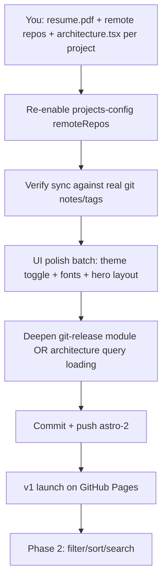

# Portfolio astro-2 — full status in one place

Everything below synthesizes the handoff, `CONTEXT.md`, design specs, this session's work, code review, and the current repo state.

---

## Executive summary

**You are past "design only"** — the v1 **content pipeline is largely implemented**: sync module, schema, query layer, page fixes, tests, ADR, and file reorg are in place. **Build passes** with 2 local fixture projects.

**You are not at v1 launch yet.** Real project repos aren't wired back in, most UI polish from your post-AI list is untouched, and several **deepening** opportunities remain in sync/git-release/query. **Nothing has been committed** — all work is local WIP on `astro-2`.

---

## Session timeline (what happened)

| Phase | What |
|-------|------|
| **Session 1 (handoff)** | Domain grilling → `CONTEXT.md`; codebase design proposed; no code |
| **This session** | Full v1 pipeline implemented; 4-axis code review; P0–P2 review fixes; docs reorg; `lib/` vs `src/` separation; architecture-flow doc |

---

## v1 content pipeline — done

### Implemented (handoff checklist)

| # | Item | Status |
|---|------|--------|
| 1 | `lib/portfolio/schema.ts` — `webapp`, lowercase status, no `featured` | Done |
| 2 | `src/content.config.ts` imports schema | Done |
| 3 | Sync extracted to `lib/portfolio/sync/` | Done |
| 4 | `git-release.ts` — git notes, release-date rules | Done (verify against real repos with notes) |
| 5 | `relations.ts` — bidirectional graph | Done |
| 6 | `query.ts` — pages use query layer | Done |
| 7 | Page bugs — homepage 3-recent, no filter tabs, related card `> 0` | Done |
| 8 | Architecture pipeline — `architecture.tsx` → `architecture.json` | Done (AST parse, no execution) |

### Also done

- **ADR-0001** accepted; updated for `lib/` / `src/` / `tests/` split  
- **20 vitest tests** in `tests/portfolio/`  
- **Code review fixes** — git notes API, binary preview fetch, safe TSX parse, strict category, branch consistency, hero fields, required architecture, resume sync hook  
- **Docs** — `docs/legacy/`, `docs/new-source-of-truth/architecture-flow.md`, `content-inputs.md` aligned with code  
- **Dead code removed** — `src/data/architecture/`  

### Current module layout

```
lib/portfolio/          ← build-time: schema + sync
src/lib/portfolio/      ← runtime: query + display
tests/portfolio/        ← tests
scripts/sync-content.ts ← thin CLI
src/content/            ← generated (gitignored)
```

---

## What's left — by owner

### A. Your action items (content / repos)

These block a real portfolio, not just fixtures:

| Task | Why |
|------|-----|
| **Add `resume.pdf`** next to root `portfolio.md` | Sync warns and skips if missing |
| **Re-add remote repos** to `projects-config.json` | Currently `remoteRepos: []` — only 2 local fixtures sync |
| **Per remote project:** valid `## Project Category` in `project.md` | Sync throws if missing/invalid (no more `devops` fallback) |
| **Per remote project:** `architecture.tsx` with `export const architectureData = {...}` | Required — sync fails without it |
| **Per remote project:** `preview.png` | Optional but expected for cards |
| **Git notes + semver tags** on project repos | Status/version/release date come from git; without notes → `dev` |
| **Author `portfolio.md`** fully | Hero uses `heroAdditionalText` + `heroSection`; fill both meaningfully |
| **Restore real projects** (optional) | 4 legacy flat `PROJ-*.md` samples were removed; recreate as proper fixture dirs if needed |

**Deferred remote example:** `MysteryMan11/Data-Science-Internship` was removed from config because its `project.md` lacked category + architecture.

---

### B. Codebase — still to fix or deepen

#### High priority (launch blockers or correctness)

| Item | Notes |
|------|-------|
| **Real git metadata on remotes** | Fixtures use local files; remotes need tags + notes — test after re-adding repos |
| **Only 2 projects in build** | Site is thin until remotes return |
| **`architecture.json` outside content collection** | Loaded via `query.getArchitectureData()` glob + fs fallback — could deepen (see architecture review) |
| **Hero still partially hardcoded** | `"Available for projects"` label in `index.astro` is not from `portfolio.md` |
| **Commit the WIP** | Large uncommitted diff on `astro-2`; no push yet |

#### Architecture review — deepening candidates (post-reorg)

From the HTML architecture review; pick one to grill next:

1. **Release Date resolution module** *(top pick)* — unify git notes + tags behind one interface in `git-release.ts`  
2. **Architecture loading in query** — remove dual `import.meta.glob` + `fs.existsSync` paths  
3. **Content Sync orchestrator** — extract frontmatter writer adapter (narrow `syncPortfolio` interface)  
4. **Related Project graph** — clarify sync vs query ownership  

#### Code review leftovers (lower)

| Item | Severity |
|------|----------|
| Bearer token forwarded on HTTP redirects in GitHub adapter | Medium security |
| `README.md` broken link to `docs/dump/...` | Docs hygiene |
| `skills-lock.json` path drift vs `.agents/skills/` | Tooling only |

---

### C. UI / UX — `docs/things-to-improve-after-AI.md`

**Not started** in this session (explicitly deferred). Grouped:

**Bugs**

- Dark mode toggle breaks on client navigation (`astro:beforeload` / `transition:persist` discussed)  
- Fonts work in `pnpm dev` but not `pnpm preview` / production build  
- Lighthouse performance issues  

**Design system**

- Lock design system (TweakCN Vercel theme suggested) before more AI UI churn  
- Font/theming inconsistency across Starwind components and page sections  
- Navbar dark-mode transition delay (legacy copied classes)  

**Layout / polish**

- Hero layout vs reference photo (center title + 3 category cards — cards exist, layout may not match reference)  
- Homepage project row — logic is 3-recent (not `featured`); visual polish may still lag design-guidelines  
- Project cards — translucent like navbar, Starwind rewrite, preview image styling  
- Project detail — typography/prose consistency, translucent property/related cards  
- Projects page "stair step" `page-container` sections — needs proper fix  
- Subtle section color/translucency differences  

**Consult before doing**

- Morph transitions — ask first  
- `?q=` URL query params for filter/sort — **phase 2+** per CONTEXT and design-guidelines  

---

### D. Feature phases

#### v1 scope (CONTEXT) — remaining gaps

| v1 requirement | Code status | Gap |
|----------------|-------------|-----|
| Sync before every build | Yes | — |
| Projects page: header + 3-col grid, no filters | Yes | Visual polish only |
| Homepage: 3 recent by release date | Yes | — |
| Hero from `portfolio.md` | Partial | Hardcoded "Available for projects" |
| Architecture required per project | Enforced at sync | Need real `architecture.tsx` in every repo |
| Experience on About only | Likely yes | Verify against design-guidelines |
| Static SSG, `astro:env` only | Yes | — |
| Related projects bidirectional | Yes | — |

#### Phase 2+ (explicitly deferred — do not build yet)

From `design-guidelines.md` and CONTEXT:

- Projects page filter / sort / search / list view / URL query params  
- Notion-style table UI  
- Homepage experience timeline (design-guidelines still mentions it; CONTEXT defers to About only — **discussion**: design-guidelines homepage "Featured Experience" conflicts with CONTEXT)  
- Skills aggregated from all projects (content-inputs mentions as future option)  

#### Phase 3+ / ideas (`things-to-improve-after-AI.md`)

- "Features" section on project detail (OAuth, Passkeys, etc.) below tech stack  
- Morph transitions  
- CSP, performance hardening  

---

### E. Docs & discussions still open

| Topic | State |
|-------|-------|
| **`personal/` vs `portfolio/` folder name** | Code uses `personal/` per content-inputs; your mental model said `portfolio/` — documented in architecture-flow; no rename unless you want it |
| **`site.md` vs raw `portfolio.md`** | Sync transforms to structured frontmatter — intentional |
| **`architecture.json` vs `.tsx` in output** | JSON by design (security); ADR-0001 |
| **Portfolio content in sync config** | Hardcoded root paths; no remote portfolio fetch yet |
| **Homepage experience section** | design-guidelines wants timeline; CONTEXT says About only for v1 |
| **Design-guidelines vs CONTEXT on "featured"** | Resolved in code: recency only, no `featured` flag |
| **Handoff "open questions"** | ADR vs schema first — **resolved** (ADR + implementation done) |
| **Git status source** | **Resolved** — git notes, not tag prerelease |

---

## How the pipeline actually works (your model vs code)

See [`docs/new-source-of-truth/architecture-flow.md`](docs/new-source-of-truth/architecture-flow.md).

**Your 3-step model is correct in spirit:**

1. **Sync** → writes `src/content/projects/{slug}/` and `src/content/personal/`  
2. **Astro collections** + Zod schema → app  
3. **Astro** handles icons, fonts, env, etc.

**Key differences from a naive reading:**

- `architecture.tsx` becomes **`architecture.json`** at sync  
- `portfolio.md` becomes **`site.md`** with YAML frontmatter  
- Output folder is **`personal/`** not `portfolio/`  
- Sync **parses and regenerates** `project.md`; it doesn't copy verbatim  
- **Query layer** sits between pages and `getCollection`  

---

## Verification snapshot (last known)

| Command | Result |
|---------|--------|
| `pnpm test` | 20/20 |
| `pnpm sync` | 2 fixture projects |
| `pnpm astro check` | 0 errors |
| `pnpm build` | Pass (~5 pages) |

---

## Suggested order of work from here



**Petty next steps (smallest wins):**

1. Drop `resume.pdf` beside `portfolio.md`  
2. Add one real remote repo with category + `architecture.tsx` + git notes  
3. Run `pnpm sync` and confirm 3+ projects  
4. Fix dark mode on route change (diagnosing-bugs skill)  
5. Commit when happy  

---

## Reference map

| Doc | Purpose |
|-----|---------|
| [`CONTEXT.md`](CONTEXT.md) | Domain glossary + v1 decisions |
| [`docs/new-source-of-truth/content-inputs.md`](docs/new-source-of-truth/content-inputs.md) | Field definitions |
| [`docs/new-source-of-truth/design-guidelines.md`](docs/new-source-of-truth/design-guidelines.md) | Page/section UI spec |
| [`docs/new-source-of-truth/architecture-flow.md`](docs/new-source-of-truth/architecture-flow.md) | Sync → Astro pipeline |
| [`docs/adr/0001-portfolio-content-module.md`](docs/adr/0001-portfolio-content-module.md) | Module layout ADR |
| [`docs/things-to-improve-after-AI.md`](docs/things-to-improve-after-AI.md) | UI/bug backlog |
| [`docs/astro-2-portfolio-handoff.md`](docs/astro-2-portfolio-handoff.md) | Original handoff (partially stale — implementation landed) |

---

If you want this persisted in the repo (e.g. `docs/status.md` updated on each milestone), say the word. Otherwise pick a lane: **content authoring**, **UI polish**, or **architecture deepening** — I can turn that slice into issues or an implementation plan next.
